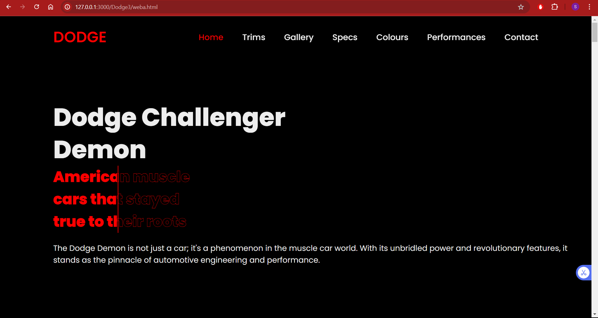
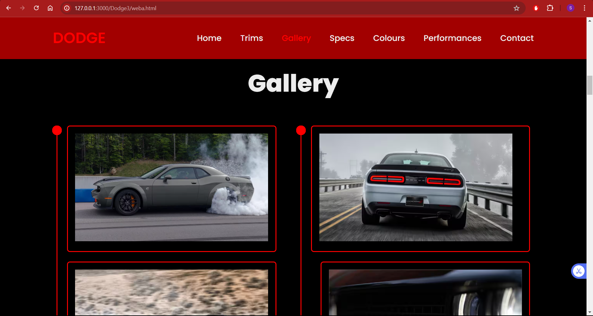
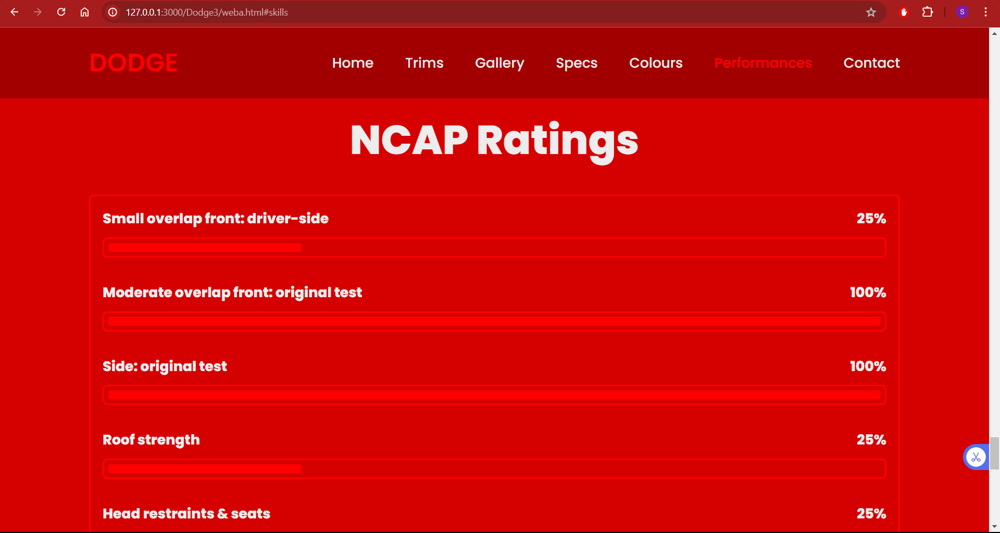
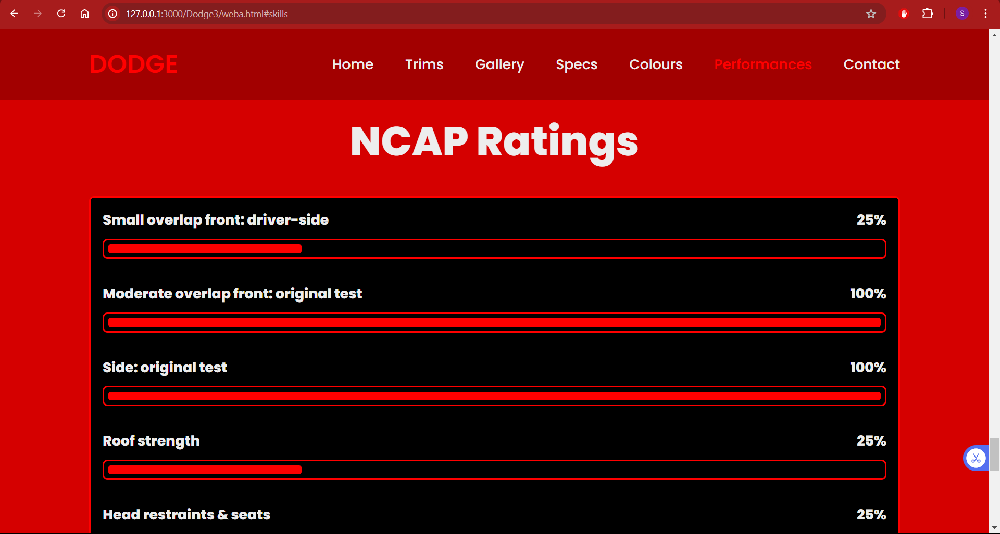

# Web3
Website 3

Link to the website: https://hwushyam2005.github.io/Web3/weba.html
 
 
In this website I have created a website on the Dodge Challenger Demon.
 
This website not only talks about the specific model but also talks about the other trims with the extra features that comes with each trim
 
 
The website has a navigation bar that changes color and also directs it directly in the same webpage.
 
These are the sections the website consist of:
 
-> Home 
 
-> Trims 
  
-> Gallery 
 
-> Specs 
 
-> Colours 
  
-> Performances 
  
-> Contact Us
 
 
-> This screen shot is of the home page with a short note on the challenger and a small line with a small color transition on the text.

 
 
-> This screen shot is of the gallery section which is also similar to the color section.

 
 
-> This one is of the before and after transition of the NCAP ratings of the safety of the Challenger.
 
This is the before image:

 
 
And this is how it will look after we keep the curson on top of it:

